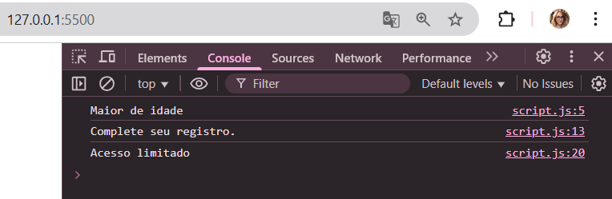

# AtvCondicionaisJS

Foi realizada uma atividade onde precisei:  
Criar um sistema em JavaScript onde solicita ao usuário a idade e o status de registro (registrado ou não registrado). Com base nesses dados, usei um operador ternário para verificar se ele é maior ou menor de idade, uma estrutura `switch` para exibir uma mensagem conforme o status informado, e operadores lógicos para mostrar se o acesso será completo ou limitado.

As entradas que foram utilizadas como teste foram:

idade = 25  
registro = Não registrado  

E essa foi a saída no meu console:

